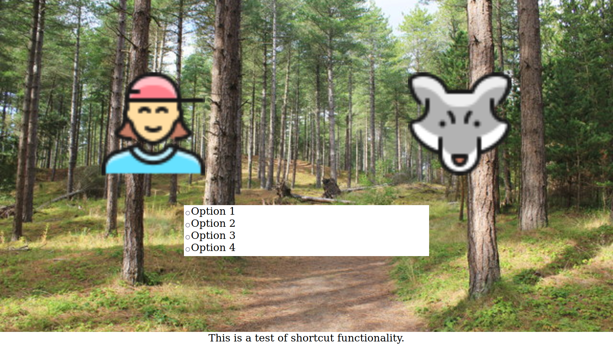

# redcap-if

This is the code for a submission for the [Interact-IF game jam](https://interact-if.tumblr.com/post/672143584722649088/welcome-to-interact-ifs-2022-game-jam-the-jams).

## Installation

1. Download and install the latest version of [python3](https://www.python.org/downloads/)
2. Download this project with [git](https://git-scm.com/) or from the latest [zip version](https://github.com/mapto/redcap-if/archive/refs/heads/main.zip)
3. Install the required dependencies by opening the project directory with a command prompt and running:
```
pip3 install -r requirements.txt
```

## Running

From a command prompt in the project directory run:
```
python3 main.py
```
Then with your browser open http://0.0.0.0:3000/scene and you should see this wireframe (red from the compiled files for [story.yarn](story.yarn))





To change configuration edit your local [config.py](https://github.com/mapto/redcap-if/blob/main/config.py)


## Credits

- Using [YarnRunner-Python](https://github.com/relaypro-open/YarnRunner-Python)
- Icon placeholders from [StreamlineHQ](https://streamlinehq.com/)

